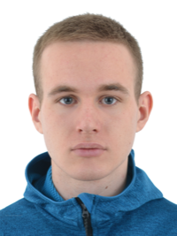

## Vladislav Boiarinov
***
### Contacts
- Location: Minsk, Belarus
- Discord: Vlad Boiarinov(@vladboyarinov1)
- GitHub: vladboyarinov1
- E-mail: boyarinov.2002@bk.ru
- Phone: +375(29)8336185
***
### Purpose
Get Frontend Developer position
***

### Professional skills
HTML code: HTML, CSS, methodology BEM. Preprocessing: SCSS.
Tools: VS Code, GitHub pages.
Background knowledge: JavaScript, React Graphic editors: Avocode, Photoshop,Figma.
***
### Code Example
    function opposite(number) {
        return(-number)
    }
***
### My projects

* https://vladboyarinov1.github.io/mebeland/
* https://vladboyarinov1.github.io/sushi/ 
* https://vladboyarinov1.github.io/yoga/
***

### Languages
* English Pre-Intermediate
***
### Education
2020-2024
Belarussian National Technical University Faculty of Information Technology and Robotics Information technology software
***

